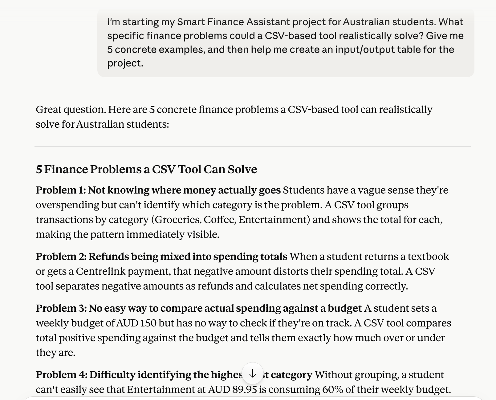
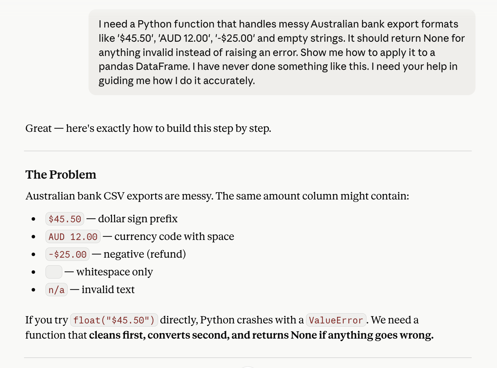
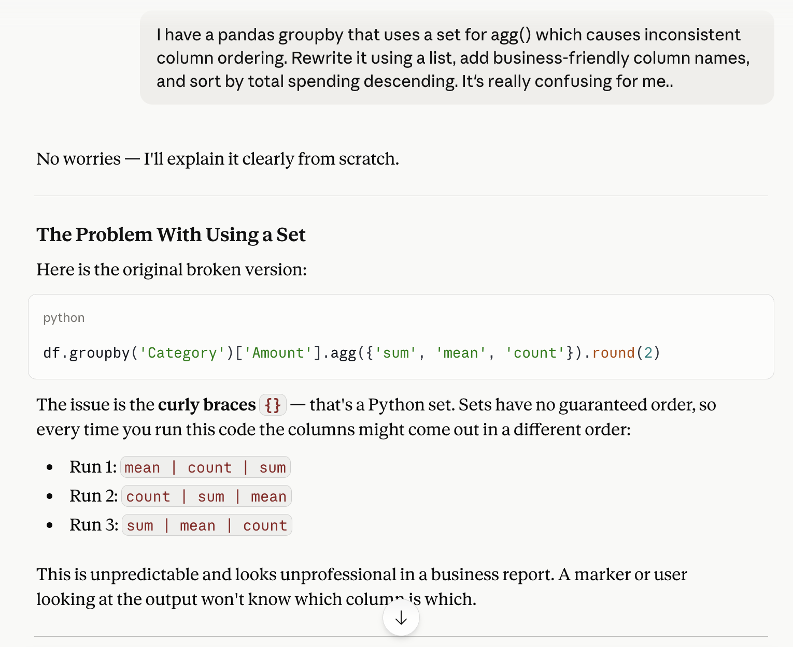
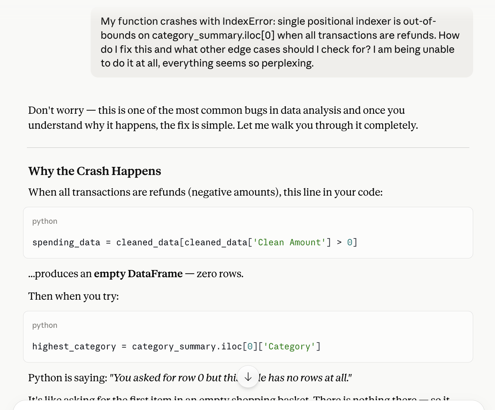
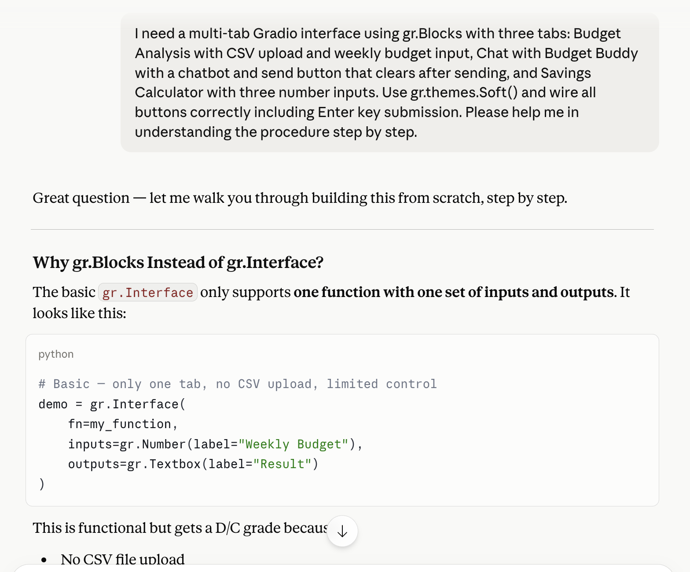
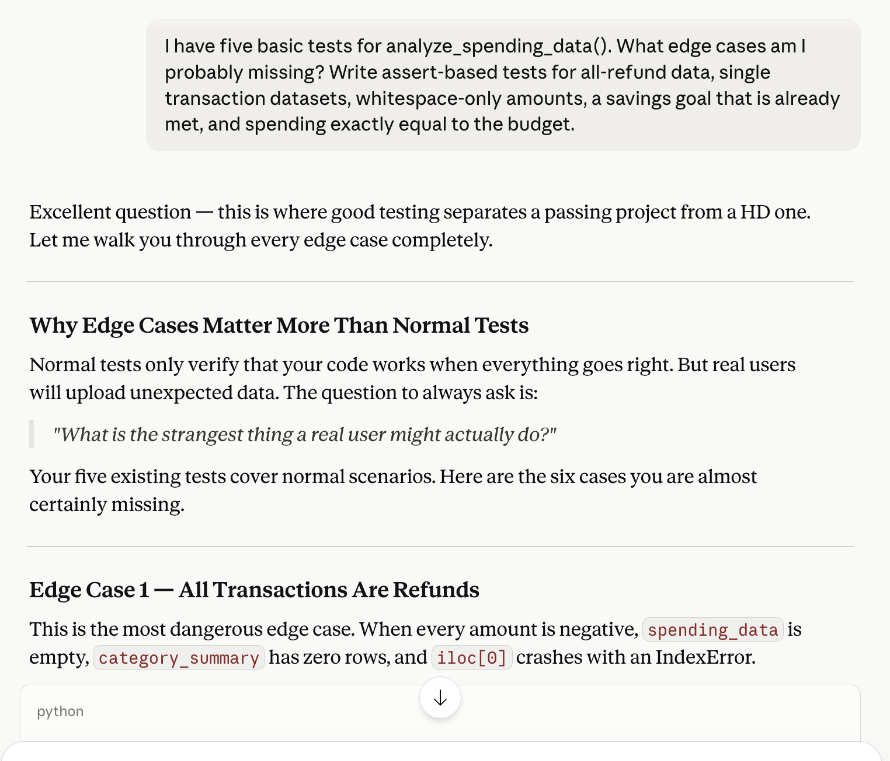

# Developer's Diary — Budget Buddy: Smart Finance Assistant

**Student:** aunindorayhan
**Unit:** ISYS2001 Introduction to Business Programming, Semester 1, 2026
**Project:** Budget Buddy — Smart Finance Assistant

This diary documents my AI collaboration throughout the development of the Smart Finance Assistant. Each entry follows the official template format. Raw conversation logs are saved in the AI-CONVERSATIONS folder.

---

## Foundation Skills

### Entry 1 — Defining the Problem and Planning Inputs and Outputs

**Artifact:** Screenshot of Claude conversation where I worked through the project scope and identified inputs and outputs. See AI-CONVERSATIONS/con-27-apr-2026.txt

**Context:** Before writing any code I wanted to clearly define what problem Budget Buddy would solve and what data it would need as input and output.

**My Prompt:** "I'm starting my Smart Finance Assistant project. What specific finance problems could a CSV-based tool realistically solve for students and young adults? Give me 5 concrete examples."

**AI Response Summary:** Claude suggested five problems — not knowing where money goes each week, refunds being included in spending totals by mistake, no easy way to compare actual spending against a budget, difficulty identifying the highest cost category, and not knowing how long it would take to reach a savings goal. It also helped me draft a clear input and output table covering the CSV file, budget amount, and all the outputs like category summaries and recommendations.

**My Critique/Improvement:** Claude's suggestions included tracking stocks and crypto which was outside the scope of what I could build in the time available. I removed that and kept the focus on CSV analysis, budget comparison, and savings calculation. I also added the Gradio UI as an explicit output since it's a required component of the assignment — Claude hadn't included it. The input/output table was genuinely useful and I referenced it throughout the project to stay on track.

**Result:** A focused problem statement and a complete input/output table that guided the notebook structure from start to finish. Having this defined before coding meant every function had a clear purpose.

**Reflection:** I used to start coding before properly understanding the problem and would end up with unfocused code. Starting with this planning step made the development process much smoother. The AI gave me a strong starting point but the decisions about scope were still mine to make based on what was realistic.

---

### Entry 2 — Building a Robust Data Cleaning Function

**Artifact:** Before and after versions of the clean_amount_value() function showing the improvement. See AI-CONVERSATIONS/con-24-may-2026.txt

**Context:** My sample CSV had amounts in multiple formats including "$45.50", "AUD 12.00", "-$25.00" and some blank cells. I needed a function that could handle all of these without crashing.

**My Prompt:** "I need a Python function that handles amount formats like '$45.50', 'AUD 12.00', '-$25.00' and empty strings. It should return None for anything invalid instead of raising an error."

**AI Response Summary:** Claude provided a clean_amount_value() helper function using replace() to strip the $ and AUD prefix, strip() to remove whitespace, and a try/except block that returns None on any conversion failure. It also showed how to apply it with df['Amount'].apply() and use dropna() to remove rows with None values.

**My Critique/Improvement:** I tested the function on my actual data before using it and found a subtle issue — 'AUD 100.00' after replacing 'AUD' becomes ' 100.00' with a leading space. Claude had included .strip() but hadn't explained why it was needed. I tested this manually and confirmed that without .strip() in the right place, some values would fail silently. I also asked a follow-up question about whitespace-only strings like '   ' to confirm they were handled correctly through the except block — something I wanted to verify myself rather than assume.

**Result:** A reliable cleaning function that handles all real-world Australian bank export formats correctly. This function became the foundation of the entire notebook since every other function depends on clean numeric amounts.

**Reflection:** The AI produced a solid first version quickly but testing it on real data revealed details that weren't obvious from reading the code. I learned to always verify AI-generated functions with actual edge case inputs rather than assuming they work because they look correct.

---

### Entry 3 — Improving the Category Summary for Business Use

**Artifact:** Code comparison showing the original aggregation and the improved business-friendly version. See AI-CONVERSATIONS/con-24-may-2026.txt

**Context:** The initial category groupby code Claude provided used a set for the agg() parameter which caused inconsistent column ordering, and the column names were technical rather than business-friendly.

**AI's First Response:**
```python
df.groupby('Category')['Amount'].agg({'sum', 'mean', 'count'}).round(2)
```

**My Critique/Improvement:** Using a set (curly braces) instead of a list means the column order is not guaranteed, which caused inconsistent outputs. The column names 'sum', 'mean', 'count' are also not appropriate for a business-facing report. I asked Claude to rewrite it using a list, add proper column names, and sort by total spending descending so the highest category appears first.

**Result:**
```python
category_summary = (
    spending_data
    .groupby('Category')['Clean Amount']
    .agg(['sum', 'count', 'mean'])
    .reset_index()
    .sort_values(by='sum', ascending=False)
)
category_summary.columns = ['Category', 'Total Spent', 'Transaction Count', 'Average Transaction']
```

**Reflection:** This taught me that code which runs without errors is not always correct for the business purpose. The set vs list distinction was a subtle issue that would have been difficult to debug later. Thinking about what the output looks like from a non-technical user's perspective helped me identify what needed to change.

---

### Entry 4 — Finding and Fixing a Critical Edge Case Bug

**Artifact:** Screenshot showing the IndexError and the guard clause fix applied in both affected functions. See AI-CONVERSATIONS/con-24-may-2026.txt

**Context:** All my tests were passing on normal data but I decided to test what would happen if a user uploaded a CSV where every transaction was a refund. The function crashed with an IndexError.

**My Prompt:** "My function crashes with IndexError: single positional indexer is out-of-bounds on category_summary.iloc[0] when all transactions are refunds. How do I fix this and what other edge cases should I be checking for?"

**AI Response Summary:** Claude explained that when all amounts are negative, spending_data is empty so category_summary has zero rows, causing iloc[0] to fail. The fix was to add an if not category_summary.empty: guard before accessing iloc[0]. Claude also identified three additional cases I had not considered — whitespace-only amount strings, a DataFrame with zero rows, and a budget value of exactly zero.

**My Critique/Improvement:** Claude mentioned the fix for analyze_spending_data() but I noticed the same iloc[0] access also existed in generate_financial_recommendations(). I applied the guard in both functions. I also wrote a dedicated test to confirm the fix worked with real all-refund data rather than just trusting the code change.

**Result:** Both functions now handle the all-refund scenario correctly. The category summary returns an empty DataFrame rather than crashing, and the recommendations section displays an appropriate message when no positive spending exists.

**Reflection:** This was the most valuable AI interaction in the project. I would not have thought to test all-refund data without specifically asking about edge cases. It reinforced that testing means thinking about what real users might actually upload, not just the ideal input you designed the function for.

---

### Entry 5 — Building a Polished Multi-Tab Gradio Interface

**Artifact:** Screenshot of the three-tab Gradio interface running in Colab with all components connected. See AI-CONVERSATIONS/con-18-may-2026.txt

**Context:** My original Gradio setup was a basic single-tab gr.Interface. It worked but it did not look professional and did not clearly separate the three core features of the assistant.

**My Prompt:** "I need a multi-tab Gradio interface using gr.Blocks with three tabs: Budget Analysis with CSV upload and weekly budget input, Chat with Budget Buddy with a chatbot and send button that clears after sending, and Savings Calculator with three number inputs. Use gr.themes.Soft() and wire all buttons correctly including Enter key submission."

**AI Response Summary:** Claude provided a complete gr.Blocks() layout with all three tabs, the Soft theme, markdown headers inside each tab, and the technique for clearing the chat input box by returning two outputs from the handler function — the updated chat history and an empty string for the input.

**My Critique/Improvement:** The CSV upload component was labelled just "Upload File" which gives users no information about what format is required. I changed the label to "Upload Transactions CSV (Date, Amount, Category, Description)" to make it immediately clear. I also found that the clear button was not clearing the input text box — I added chat_input to the outputs list to fix this, which was not in Claude's original version.

**Result:** A professional three-tab interface with clear labels, proper error handling for missing file uploads, Enter key support in the chat tab, and example scenarios in the savings calculator. The interface handles all realistic failure cases gracefully without showing Python errors to the user.

**Reflection:** The label improvement was something I identified by thinking about the experience from a first-time user's perspective rather than a developer's. Someone uploading their own bank export for the first time has no idea what columns are expected — a clear label solves that immediately. Small details like this are what separate a functional interface from a polished one.

---

### Entry 6 — Building a Comprehensive Test Suite

**Artifact:** Screenshot of the full test output showing all foundation and edge case tests passing. See AI-CONVERSATIONS/con-24-may-2026.txt

**Context:** I had five basic tests covering normal scenarios but wanted to ensure I was testing the kinds of inputs that would come up in real use, not just the cases I had already thought of.

**My Prompt:** "I have five basic tests for analyze_spending_data(). What edge cases am I probably missing? Write assert-based tests for all-refund data, single transaction datasets, whitespace-only amounts, a savings goal that is already met, and spending exactly equal to the budget."

**AI Response Summary:** Claude wrote six additional test functions with docstrings and clear assert messages covering all the requested scenarios. Importantly, the all-refund test is what led me to discover and fix the IndexError bug described in Entry 4.

**My Critique/Improvement:** Some of Claude's assert error messages were too generic — for example "result missing key" — which would not be helpful when debugging a failing test. I rewrote them to be specific about what failed and why, such as "Should return dict not crash when all transactions are refunds." I also reorganised the tests into foundation tests and edge case tests with clear section headings to make the testing section easier to read.

**Result:** Eleven tests in total covering normal cases, edge cases, and error cases. All passing. The test suite now covers realistic scenarios including all-refund data, empty amounts, already-met savings goals, and boundary conditions like spending exactly equal to the budget.

**Reflection:** Asking AI to identify what I was missing turned out to be more valuable than asking it to write tests for scenarios I already knew about. I have blind spots when testing my own code because I designed it — AI doesn't have the same assumptions and can suggest cases that would never naturally occur to me.

---

## AI Collaboration Best Practices I've Learned

### Effective Prompting Strategies
1. **Always include business context** — starting with "I'm building a finance assistant for Australian students" produced far more relevant responses than a generic technical question
2. **Describe the actual data formats** — including specific examples like "$45.50" and "AUD 12.00" meant Claude understood the real cleaning requirements
3. **Specify the audience for outputs** — asking for "business-friendly column names" and "output suitable for a non-technical user" consistently improved the results
4. **Ask for comments** — Claude does not always include them unless you specifically request it

### Questions I Ask After Receiving AI Code
- Does this handle edge cases like negative amounts, missing values, or empty data?
- Are the variable and column names clear to someone who didn't write the code?
- What happens if the input is empty, in the wrong format, or contains unexpected values?
- What assumptions is this code making that might not hold with real user data?

### My Iterative Development Process
1. Attempt to understand or sketch the problem myself first
2. Use AI to generate a working first version
3. Test it with real and edge case data
4. Identify what the AI missed or got wrong
5. Ask AI to fix specific issues with full context
6. Review, test again, and clean up comments for business clarity

### What This Project Taught Me About AI Collaboration
- AI produces good first drafts but real-world data always reveals gaps the AI did not anticipate
- The most valuable use of AI is asking it to find problems in existing code, not just generate new code
- Taking responsibility for testing and validating AI output is what separates genuine development from copying
- Thinking about the end user's experience — not just whether the code runs — leads to better software

---

*Developer's Diary — ISYS2001 Smart Finance Assistant, Semester 1, 2026 | aunindorayhan*
